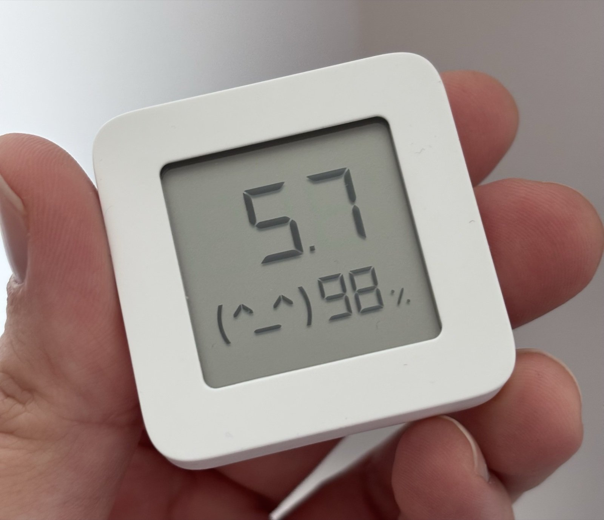

# LCD Ticker

**Turn a cheap Xiaomi thermometer into a tiny Home Assistant display.**

LCD Ticker shows any Home Assistant value on the LCD of a Xiaomi **LYWSD03MMC** running [pvvx firmware](https://github.com/pvvx/ATC_MiThermometer). Examples: solar output, the temperature in another room, an average of several sensors, or the electricity price in cents. It can rotate between several screens, and it's careful with the coin cell. Everything is set up in the Home Assistant UI, with no YAML.

<p align="center">
  
</p>

[](https://my.home-assistant.io/redirect/hacs_repository/?owner=mikkmihkel&repository=ha-lcd-ticker&category=integration)

## Quick start

1. **Flash pvvx firmware** onto the thermometer from your browser (see [below](#flash-the-firmware)).
2. **Install LCD Ticker.** Use the HACS button above, then **Download** → restart Home Assistant. For a manual install, unzip `lcd_ticker.zip` from the [latest release](https://github.com/mikkmihkel/ha-lcd-ticker/releases) into `config/custom_components/lcd_ticker/` and restart.
3. **Add the thermometer.** Go to **Settings → Devices & services**. It shows up as a discovered `ATC_xxxxxx`. If it doesn't, use **Add integration → LCD Ticker**.
4. **Pick a battery profile.** A test smiley `(^_^)` appears on the LCD, which confirms the connection works.
5. **Add a screen.** See [Add a screen](#add-a-screen). The LCD updates within a few seconds.

You need Home Assistant **2026.3+** and Bluetooth that can make connections. A Raspberry Pi's built-in Bluetooth works, and so does an ESPHome Bluetooth proxy.

## Add a screen

On the thermometer, choose **Add screen**.

1. **Pick the numbers.** Choose the big number and a symbol next to it (for example °C). Optionally choose a small number and tick the `%` sign.
2. **Check the preview.** It shows each entity's name, its state, and what the LCD will show. Open **Advanced** if something needs changing: a multiplier, decimals, a unit conversion, VAT, a face, or conditions. Tick **Preview again** to see the result before saving.
3. **Save.** Submit the form.

Good to know:
- **Values are shown as they are** until you change Advanced options. For prices, set the conversion to *Cents per kWh* and enter your VAT %. W to kW, °F to °C and EUR/MWh to c/kWh are handled by the conversion.
- **For averages, minimums or sums**, create a *Min/Max* or *Statistics* helper in Home Assistant, then pick it as the big number.
- **Solar self-consumption**: under Advanced, set *Small number shows* to *Solar self-consumption %* and pick your grid export sensor. The big number is the solar production.

The LCD shows only digits and a few symbols, so give each screen a marker you'll recognise: a unit symbol (°C, °F, `-`, `_`, `=`), the `%` sign, the battery icon, or a face. You get a warning if two screens look identical.

Screens made with earlier versions keep working. **Edit screen** opens the same two steps with your settings filled in.

## Examples

1. **Sauna, only while it heats.** Create a *Threshold* helper called "Sauna heating" (sauna temperature above 40 °C). Add a screen with the sauna temperature as the big number and the symbol °C. In Advanced, set *Face* to *Always the same face*, set *Only show while this is on* to the threshold sensor, and turn on *Show only this screen while it is on*, so the sauna temperature replaces the other screens until it cools down.
2. **Home average.** Create two *Min/Max* helpers (type: mean), one from your temperature sensors and one from your humidity sensors, or use averages you already have (e.g. `sensor.home_average_temp` and `sensor.home_average_hum`). Add a screen with the temperature as the big number (symbol °C) and the humidity as the small number, with the `%` sign. In Advanced, set *Face* to *Depends on the value*, *Face follows* the small number, *Direction* to *Middle is best*, and thresholds 30, 40, 60 and 70. The face is happiest at 40-60 % humidity and sad below 30 % or above 70 %.
3. **Electricity price in the daytime.** Create a *Schedule* helper "Daytime". Add a screen with your price sensor as the big number. In Advanced, set *Convert big number to* *Cents per kWh*, enter your VAT %, and set *Only show while this is on* to the schedule. Or, if your price sensor is in EUR/kWh, set the multiplier to 124 (100 for cents × 1.24 for 24 % VAT).

Each screen's setup shows a **live preview** of what the LCD will display, including the raw value it converts from. The **Display** sensor shows what is on the LCD right now.

## How screens and battery work

Each thermometer has one of two modes:
- **Single screen + built-in reading.** The thermometer alternates your value with its own temperature and humidity. This costs no extra battery.
- **Rotating screens.** LCD Ticker cycles through your screens. You can add the thermometer's own reading as one of them.

Every change on the LCD is one short Bluetooth connection. To keep the battery steady:
- A screen is written only when what it shows actually changes.
- Automatic writes are at least **60 seconds** apart.
- **Configure** shows the expected updates per hour for your settings and warns above 30.

| Battery profile | Seconds per screen | While someone is present |
|---|---|---|
| Eco | 900 | 300 |
| **Balanced** (default) | 480 | 180 |
| Responsive | 180 | 90 |

Optional settings:
- **Faster when present.** Pick a motion sensor or person, and screens rotate faster while it's on.
- **Quiet hours** or an **only active when** entity (for example "solar producing"). While inactive, nothing is sent, and the LCD shows its own reading, zeros or the last screen.
- **Show immediately on big change.** Per screen: jump to it when its value changes a lot.
- **If Home Assistant stops**, the display either freezes on the last screen or falls back to its own reading.

## Controls in Home Assistant

Each thermometer gets its own device with these entities:
- **Rotation** (switch)
- **Mode** (select)
- **Screen** (select, pick one to show it now)
- **Seconds per screen** and **Seconds per screen while present** (number)
- **Refresh now** (button)
- **Display** (sensor, what the LCD shows now)
- **Last update**, **Updates in the last hour** and **Estimated updates per hour** (sensors)
- The thermometer's own **Temperature**, **Humidity**, **Battery**, **Voltage** and **Signal strength** (off by default). They are read passively from its Bluetooth broadcasts, so they cost no battery.
- **Reachable** (binary sensor)
- **Last error** (sensor, off by default)

They all work on dashboards and in automations.

To send a one-off value from an automation:

```yaml
action: lcd_ticker.show
data:
  address: "A4:C1:38:XX:XX:XX"   # or device_id: pick the thermometer in the UI editor
  big: 5.7
  small: 98
  percent: true
  happy: true
  validity: 65535                # 65535 = keep it; default 900 seconds
```

The next scheduled screen replaces it, so turn **Rotation** off first if you want it to stay. Coming from `pvvx_display`? Rename `pvvx_display.show` to `lcd_ticker.show`; the fields are the same. All fields, symbols and faces are listed in [docs/reference.md](docs/reference.md).

## Flash the firmware

> pvvx is third-party firmware. Flashing is at your own risk.

1. Open the [Telink flasher](https://pvvx.github.io/ATC_MiThermometer/TelinkMiFlasher.html) in Chrome or Edge on a computer with Bluetooth.
2. Click **Connect**, pick `LYWSD03MMC`, click **Do Activation**, and wait for *Login successful*.
3. Under *Custom Firmware*, choose the latest pvvx build (tested with [v5.7](https://github.com/pvvx/ATC_MiThermometer/releases/tag/v5.7)) and click **Start Flashing**.

Afterwards the thermometer is named `ATC_` plus six characters of its MAC. Some hardware revisions need extra steps; see the [pvvx README](https://github.com/pvvx/ATC_MiThermometer#readme).

## Troubleshooting

- **"Could not reach the thermometer"**: move it closer to the Bluetooth adapter or proxy, and check that the adapter supports connections, not just scanning.
- **It alternates with temperature/humidity**: that's normal in *Single screen + built-in* mode and with *If HA stops → Alternate*. The pvvx settings `show_batt_enabled` and `show_time_smile` can add battery or clock steps.
- **Shows 1999 or -99**: the value is beyond what the LCD can show. Check the screen's conversion and multiplier.
- **Battery level**: the **Battery** sensor on the LCD Ticker device (from the thermometer's own broadcasts; encrypted BTHome isn't supported).
- **Deleting your last screen**: turn **Rotation** off first, or the LCD keeps the last value.
- **Reporting a bug**: attach the integration's **diagnostics** download. The MAC address is removed from it.

To remove the integration, delete the thermometer under **Settings → Devices & services → LCD Ticker**. A value sent with validity 65535 stays on the LCD until the thermometer restarts, so take the battery out for a moment.

## Credits

Built on the idea and code of [jozefpis/xiaomi-LYWSD03MMC-to-solar-meter](https://github.com/jozefpis/xiaomi-LYWSD03MMC-to-solar-meter) (MIT, photo above). Thanks to [pvvx](https://github.com/pvvx/ATC_MiThermometer) for the firmware and flasher, and to the ESPHome [`pvvx_mithermometer`](https://esphome.io/components/display/pvvx_mithermometer.html) component as a protocol reference. Not affiliated with Xiaomi or pvvx.

License: [MIT](LICENSE).
